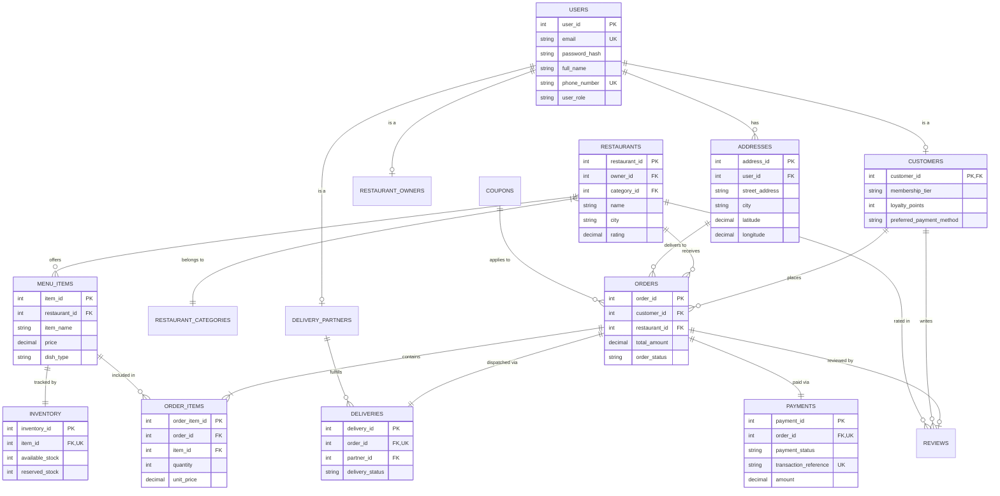

# Entity-Relationship (ER) Diagram

```mermaid
erDiagram
    USERS ||--o| CUSTOMERS : "is a"
    USERS ||--o| RESTAURANT_OWNERS : "is a"
    USERS ||--o| DELIVERY_PARTNERS : "is a"
    USERS ||--o{ ADDRESSES : "has"
    
    RESTAURANTS }|--|| RESTAURANT_CATEGORIES : "belongs to"
    RESTAURANTS ||--o{ MENU_ITEMS : "offers"
    
    MENU_ITEMS ||--|| INVENTORY : "tracked by"
    
    CUSTOMERS ||--o{ ORDERS : "places"
    RESTAURANTS ||--o{ ORDERS : "receives"
    ADDRESSES ||--o{ ORDERS : "delivers to"
    COUPONS ||--o{ ORDERS : "applies to"
    
    ORDERS ||--|{ ORDER_ITEMS : "contains"
    MENU_ITEMS ||--o{ ORDER_ITEMS : "included in"
    
    ORDERS ||--|| PAYMENTS : "paid via"
    ORDERS ||--|| DELIVERIES : "dispatched via"
    DELIVERY_PARTNERS ||--o{ DELIVERIES : "fulfills"
    
    ORDERS ||--o| REVIEWS : "reviewed by"
    CUSTOMERS ||--o{ REVIEWS : "writes"
    RESTAURANTS ||--o{ REVIEWS : "rated in"

    USERS {
        int user_id PK
        string email UK
        string password_hash
        string full_name
        string phone_number UK
        string user_role
    }

    CUSTOMERS {
        int customer_id PK, FK
        string membership_tier
        int loyalty_points
        string preferred_payment_method
    }

    ADDRESSES {
        int address_id PK
        int user_id FK
        string street_address
        string city
        decimal latitude
        decimal longitude
    }

    RESTAURANTS {
        int restaurant_id PK
        int owner_id FK
        int category_id FK
        string name
        string city
        decimal rating
    }

    MENU_ITEMS {
        int item_id PK
        int restaurant_id FK
        string item_name
        decimal price
        string dish_type
    }

    INVENTORY {
        int inventory_id PK
        int item_id FK, UK
        int available_stock
        int reserved_stock
    }

    ORDERS {
        int order_id PK
        int customer_id FK
        int restaurant_id FK
        decimal total_amount
        string order_status
    }

    ORDER_ITEMS {
        int order_item_id PK
        int order_id FK
        int item_id FK
        int quantity
        decimal unit_price
    }

    PAYMENTS {
        int payment_id PK
        int order_id FK, UK
        string payment_status
        string transaction_reference UK
        decimal amount
    }

    DELIVERIES {
        int delivery_id PK
        int order_id FK, UK
        int partner_id FK
        string delivery_status
    }
```
